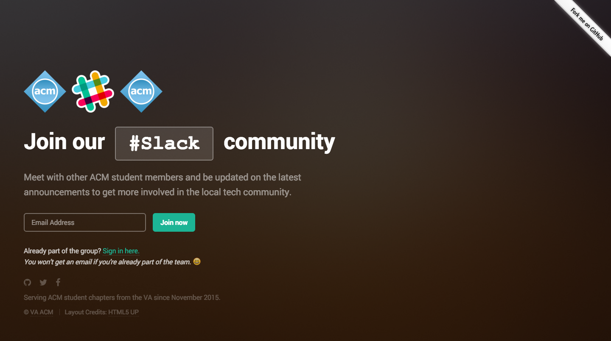

# slack-invites

[](http://forthebadge.com)

## This project is built on the [Stamplay](https://stamplay.com) platform to show you how to automate signups to your [Slack](https://slack.com/) community in just 30 minutes.



### Join our #Slack community

### Meet with other ACM student members and be updated on the latest announcements to get more involved in the local tech community.

### Serving ACM student chapters from the VA since November 2015.

> The full tutorial can be found [here](https://blog.stamplay.com/launch-your-community-with-a-fully-automated-slack-signup-page/)
>
> November 2015 © VA ACM | Layout Credits: HTML5 UP

---

## Getting Started

```bash
$ npm i -g stamplay-cli
$ cd path/to/repo
$ stamplay init
$ stamplay start
$ stamplay deploy
```

More info: https://stamplay.com/docs/hosting/command-line
